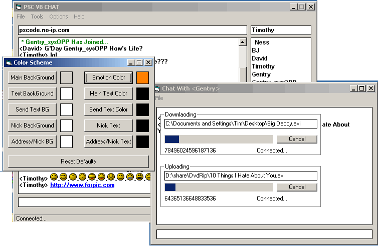



## P\.S\.C VB Chat Update

### Description

I Run A Chat Server For VB Chat.. I try to run it 24/7 on my cable its pretty cool chat room like a single room irc .. all u newbies check it out to ask questions and u pro's comon in and answer i try to update it as much as posible so im open to any suggestions... New Features : Min to Tray , Save Password , New Op Features : Select Muzzle Time, Ban Nickname, New Server Features : Better Logging, Incoming Bytes Control, Message Servie to leave msgs to other users that are offline ... NOTE: this pic is allitle out of date but u get the idea. PLEASE REMEMBER : This isnt just a code example .. use it as u wish but please join the server.
 
### More Info
 

             |
---                |---
**Submitted On**   |2002-07-30 14:41:08
**By**             |[Timothy Marin](https://github.com/Planet-Source-Code/PSCIndex/blob/master/ByAuthor/timothy-marin.md)
**Level**          |Advanced
**User Rating**    |5.0 (30 globes from 6 users)
**Compatibility**  |VB 6\.0
**Category**       |[Internet/ HTML](https://github.com/Planet-Source-Code/PSCIndex/blob/master/ByCategory/internet-html__1-34.md)
**World**          |[Visual Basic](https://github.com/Planet-Source-Code/PSCIndex/blob/master/ByWorld/visual-basic.md)
**Archive File**   |[P\_S\_C\_VB\_C1125977302002\.zip](https://github.com/Planet-Source-Code/timothy-marin-p-s-c-vb-chat-update__1-37404/archive/master.zip)

